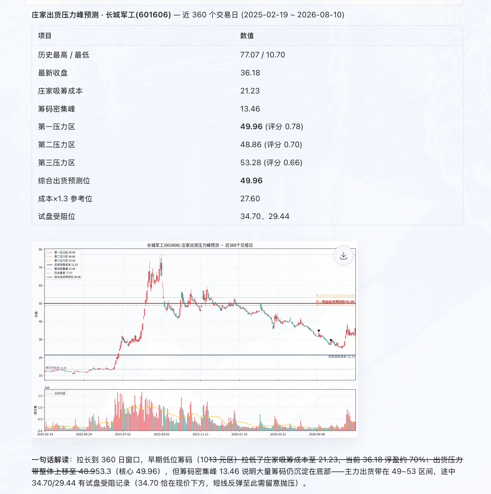
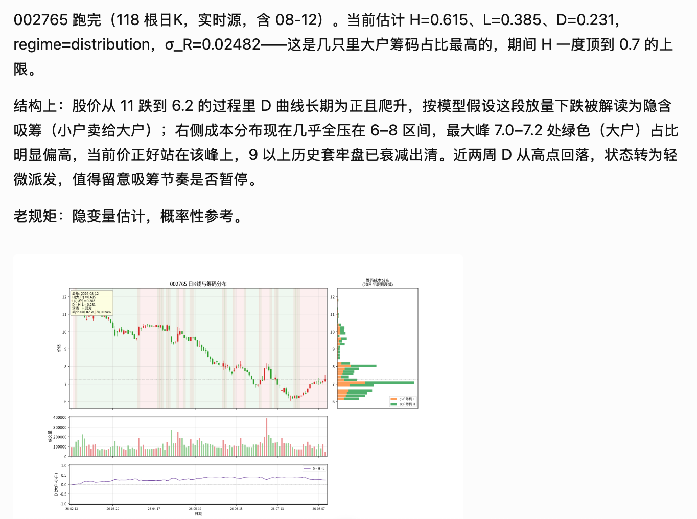
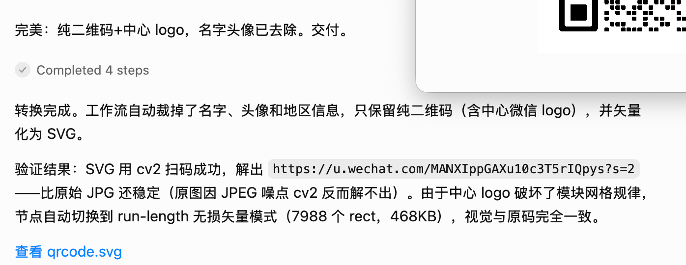
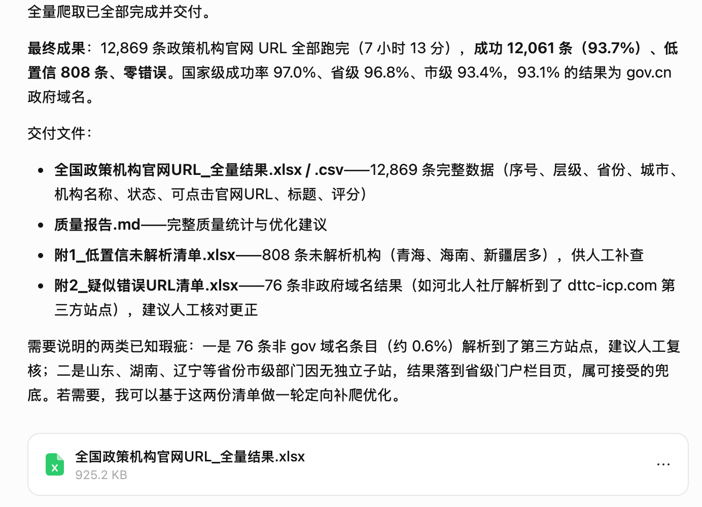

# FlowX MCP Server

FlowX 是一个通过对话创建工作流的 MCP 服务器，设计目标是能够方便地集成到 Hermes、WorkBuddy、TraeWork 等 Agent 系统中。

它基于 [MCP](https://modelcontextprotocol.io)，将 **`meta_agent`** 工作流构建器和 **`ag_ui_workflow`** 运行时引擎封装为一组工具，因此任意 MCP 客户端（Claude Code、Cursor、Codex、VS Code Copilot Chat 等）都可以：

1. 根据自然语言需求**创建**新的 AG-UI 工作流；
2. 根据修改提示词，**动态更新**工作流后端产物（`workflow.json`、`{node}.py`、`main.py`）；
3. **启动**生成后的工作流 FastAPI 后端引擎；
4. 在更新后**重载**后端；
5. **查看**每个用户输入节点所需的输入格式；
6. 通过聊天消息**执行**工作流步骤并收集结果。

它沿用了 `hermes-agent` MCP 服务器相同的 `FastMCP` 工具注册模式。默认通过 stdio 提供服务；如果你希望客户端连接到一个已经运行的实例，也可以切换为 Streamable HTTP。

---

## 架构

```text
MCP client  ──stdio / streamable-http──►  flowx_mcp.server (FastMCP)
								│
								├── meta_agent.AgentBuilder  ──►  LLM (DeepSeek/...)
								│       (create / update / plan / generate)
								│
								└── subprocess: python main.py  ──►  FastAPI backend
									│                                  │
									│   POST /api/run-step (SSE)       │
									└──────────────────────────────────┘
							 ag_ui_workflow.WorkflowEngine
```

MCP 服务器会为每个工作流维护一个 `WorkflowHandle`，其中包含 `AgentBuilder`、正在运行的后端进程、端口和会话状态。工具 3 到 6 会通过 HTTP（基于 `urllib`，无需额外依赖）与运行中的后端通信，并解析 AG-UI 的 SSE 事件流。

## 提供的工具

| 工具 | 用途 |
| --- | --- |
| `create_workflow` | 根据需求，在 `workspace/workflow_name` 下构建工作流。 |
| `update_workflow_node` | 根据修改提示词更新 `workflow.json`、`{node}.py` 和 `main.py`，并使当前运行时会话与后端失效，避免旧进程继续提供过期图结构。 |
| `start_backend` | 启动指定工作流生成的 FastAPI 后端。 |
| `reload_workflow` | 重启后端，以加载更新后的节点文件或 `workflow.json`。 |
| `restart_builder` | 从磁盘为指定工作流重新创建内存中的 `AgentBuilder`，并可选择同时重启后端。 |
| `get_node_input_formats` | 列出所有用户输入节点及其期望输入格式。 |
| `run_workflow_step` | 将聊天消息格式化为步骤输入，执行工作流并返回结果。 |
| `list_workflows` | 辅助工具：列出服务器当前已知的工作流。 |
| `list_workflow_folders` | 列出工作区根目录下在磁盘上发现的工作流文件夹。 |
| `upload_workspace_input_file` | 将 base64 编码文件保存到 `workspace/inputs` 并返回路径。 |
| `list_workflow_python_files` | 列出某个工作流文件夹下所有 `.py` 文件。 |
| `get_workflow_json` | 读取工作流根目录下的 `workflow.json` 并以 JSON 返回。 |
| `get_workflow_files` | 按文件名或相对路径读取指定工作流文件。 |
| `get_workflow_binary_files` | 读取指定工作流二进制文件，并返回 base64 内容和 MIME 类型。 |
| `replace_workflow_files` | 按文件名或相对路径替换指定工作流文件。 |

## 环境准备

必须能够导入 `meta_agent` 和 `ag_ui_workflow`。推荐以 editable 模式安装：

```bash
python3.10 -m pip install -e /Users/user/Desktop/codes/meta_agent --no-deps
python3.10 -m pip install -e /Users/user/Desktop/codes/ag_ui_worflow --no-deps
python3.10 -m pip install -r requirements.txt
```

如果你不想通过 `pip install -e` 安装它们，可以设置 `FLOWX_EXTRA_PATHS`，其值为两个源码根目录组成的冒号分隔列表，入口程序会自动将它们加入 `sys.path`。

将 `.env.example` 复制为 `.env`，并填入你的 LLM Key。

## 运行方式

```bash
# 默认：供本地 MCP Host 使用的 stdio 传输
python3.10 run_server.py
# 或开启详细日志
python3.10 run_server.py --verbose

# 长驻远程服务使用的 Streamable HTTP 传输
python3.10 run_server.py --transport streamable-http --host 0.0.0.0 --port 8000
```

如果希望 MCP Host 自己拉起 FlowX，请使用 stdio。若你希望长期运行一个 FlowX 实例并让客户端通过 URL 连接，请使用 Streamable HTTP。

## 本地 stdio MCP 客户端配置（例如 Claude Desktop / VS Code）

```jsonc
{
	"mcpServers": {
		"flowx": {
			"command": "python3.10",
			"args": ["/Users/user/Desktop/codes/FlowX/run_server.py"],
			"env": {
				"FLOWX_LLM_PROVIDER": "deepseek",
				"FLOWX_LLM_MODEL": "deepseek-chat",
				"FLOWX_LLM_API_KEY": "<your key>",
				"FLOWX_DEFAULT_WORKSPACE": "/Users/user/Desktop/codes/flowx_workspaces"
			}
		}
	}
}
```

## 已有 FlowX 远程服务的 MCP 客户端配置

如果 FlowX 已经运行在远程主机上，请在远程机器上以 HTTP 传输方式启动它，然后让客户端连接到该 MCP 端点，而不是通过 SSH 再次拉起一个新进程。

在远程机器上启动服务：

```bash
cd /home/testuser/FlowX
export FLOWX_LLM_PROVIDER=deepseek
export FLOWX_LLM_MODEL=deepseek-chat
export FLOWX_LLM_API_KEY='<your key>'
export FLOWX_DEFAULT_WORKSPACE=/home/testuser/flowx_workspaces
export FLOWX_EXTRA_PATHS=/home/testuser/meta_agent:/home/testuser/ag_ui_worflow
python3 run_server.py --transport streamable-http --host 0.0.0.0 --port 8000 --verbose
```

然后在支持 URL 方式的 MCP Host 中这样配置：

```jsonc
{
	"mcpServers": {
		"flowx-remote": {
			"url": "https://{url}/mcp"
		}
	}
}
```

如果你的 MCP Host 只支持基于 stdio 的启动命令，那么继续使用下方的 SSH 模式即可。

## 示例工作流提示词

以下提示词可以直接粘贴到已经连接 `flowx-remote` 的 MCP 客户端中。

### 1. `stock_pressure`

<details>
<summary>Prompt</summary>

```text
使用 flowx-remote 创建一个名字是 stock_pressure 的工作流。

根据下述理论构建一个工作流，根据最近 n 个交易日（用户指定）计算出指定股票（用户指定）庄家未来可能出货的价格位置，并在图表上显示。

庄家出货压力峰预测理论模型

一、模型目标

根据历史成交数据、筹码分布、庄家成本和历史高点信息，寻找未来可能形成出货压力的价格区域。

核心假设：
1. 庄家在股价大跌后低位吸筹。
2. 吸筹阶段形成庄家平均成本区。
3. 后续拉升过程中，庄家通过试盘测试上方卖压。
4. 历史大量成交区域和前期高点会形成动态压力。
5. 出货压力点由多因素共同决定。

二、输入数据

每日行情：
Date: 日期
Open: 开盘价
High: 最高价
Low: 最低价
Close: 收盘价
Volume: 成交量

三、筹码分布模型

将价格区间划分为 N 个价格桶。

对于每个价格区间 p：
C(p)=Σ Volume(t)

其中：
C(p) 表示该价格区域累计成交筹码数量。

成交峰值：
P_peak = argmax C(p)

表示市场成本最密集区域。

四、庄家吸筹成本估计

选择吸筹阶段：

条件：
1. 股价经历大幅下跌。
2. 成交量明显放大。
3. 股价进入横盘震荡。

庄家平均成本：
C_dealer = Σ(P_t × V_t) / ΣV_t

其中：
P_t: 成交价格
V_t: 成交量

得到庄家主要持仓成本。

五、历史压力峰计算

定义压力评分：
Pressure(p)= w1C(p) + w2High_Test(p) + w3Profit(p) + w4Gain(p)

其中：
1. 成交密集压力 C(p)
表示该价格区域历史交易筹码数量。

2. 历史高点压力 High_Test(p)
统计：
- 历史是否出现过高点
- 是否多次冲高失败
- 是否形成顶部区域

3. 获利盘压力 Profit(p)
计算：
Profit(p)=ΣC(x), x<p

表示当前价格以下有多少筹码处于盈利状态。

盈利筹码越多：
潜在卖压越大。

4. 庄家收益压力 Gain(p)
Gain(p)= (p-C_dealer)/C_dealer

表示庄家在该价格位置的理论收益。

六、压力峰搜索算法

步骤1：
建立价格-成交量矩阵：
price_bins = divide(min_price,max_price,N)

步骤2：
统计：
volume_profile[p]

步骤3：
计算每个价格位置：
Pressure Score

步骤4：
排序：
Score 最高的位置作为第一压力峰。

输出：
Pressure_1
Pressure_2
Pressure_3

分别代表：
第一压力区
第二压力区
第三压力区

七、动态试盘验证

庄家拉升过程中观察：

情况 A：
价格上涨，成交量下降。
说明：上方阻力较小。

情况 B：
价格上涨，成交量突然放大，同时出现长上影线，随后回落。
说明：该价格区域存在大量卖盘。

定义：
P_pressure = 当前测试失败价格

八、综合出货价格模型

最终预测：
P_exit = argmax Pressure(p)

即：
最大压力评分对应价格。

实际计算：
P_exit ≈ 庄家成本 × (1+r)

并且：
接近历史成交峰。

其中：
r: 庄家目标收益率。

九、Python 实现思路

输入：
K 线数据 DataFrame

计算：
1. 计算成交量分布
2. 估计庄家成本
3. 寻找历史高点
4. 计算盈利筹码比例
5. 计算 Pressure Score
6. 输出压力峰

伪代码：
for price in price_bins:
		score = (
				w1 * volume_density(price)
				+ w2 * historical_high(price)
				+ w3 * profit_ratio(price)
				+ w4 * dealer_gain(price)
		)

rank(score)

return top_pressure_prices

十、最终解释

庄家未来可能出货的位置，不是简单的历史最高价。
```

</details>

<p align="center">
	
</p>

### 2. `stock_distribution`

<details>
<summary>Prompt</summary>

```text
使用 flowx-remote 创建一个名字是 stock_distribution 的工作流。

根据如下理论构建一个可以预估当前和历史价格大小户筹码分布并画成图的工作流。

## 角色
你是一名量化研究员，负责根据 1 小时级 OHLCV 数据建立“隐含大小户筹码状态”模型，并识别吸筹、派发与潜在价格压力峰。

## 重要原则
1. 只有价格和成交量时，无法直接观测真实账户的大户/小户持仓。
2. large_ratio / small_ratio 是模型隐变量估计，不是真实账户持仓。
3. “上涨=大户卖给小户、下跌=小户卖给大户”是待检验假设，而不是事实。
4. 所有实时特征只能使用当前及过去数据，禁止未来函数。
5. 输出概率/置信度，不把模型结果描述成确定事实。

## 输入
CSV 至少包含：
datetime, open, high, low, close, volume

## 核心状态
H_t：估计大户筹码比例
L_t：估计小户筹码比例
H_t + L_t = 1
D_t = H_t - L_t = 2H_t - 1

R_t = (P_t-P_{t-1})/P_{t-1}
V*_t = V_t / EMA(V_t)

## 状态转移
最简可校准模型：

ΔH_t = -alpha * tanh(R_t / sigma_R) * V*_t

并限制 H_t ∈ [h_min, h_max]。

解释：
- 放量上涨：模型倾向 H 下降，即“大户→小户”的隐含分散；
- 放量下跌：模型倾向 H 上升，即“小户→大户”的隐含聚合；
- 小波动/正常成交：状态变化较小。
```

</details>

<p align="center">
	
</p>

### 3. `picture_to_svg`

<details>
<summary>Prompt</summary>

```text
使用 flowx-remote 创建一个名字是 picture_to_svg 的工作流。

创建一个上传微信二维码图片、自动去除人名信息并转成 SVG 格式的工作流。
```

</details>

<p align="center">
	
</p>

### 4. `policy_scrawler`

<details>
<summary>Prompt</summary>

```text
使用 flowx-remote 创建一个名字是 policy_scrawler 的工作流。

要求：
1. 从全国政策发布机构名录获取需要的机构名称模版。
2. 结合全国省-市-县名称，整理全国政策机构的具体搜索名称。
3. 使用 Playwright 模拟浏览器，在百度搜索对应机构官网名称。
4. 构建一个可以爬取全国政策机构官网 URL 的工作流。
```

</details>

<p align="center">
	
</p>

### 5. `start-up-hiring`

<details>
<summary>Prompt</summary>

```text
flowx-remote-us帮我构建一个到LinkedIn上找n个正在招人的AI startups的创始人的爬虫工作流
```

</details>

<p align="center">
	
</p>

## 联系方式

如果你对使用 FlowX 或共同建设这个项目感兴趣，可以发邮件联系我：[peterxcx@gmail.com](mailto:peterxcx@gmail.com)。

微信二维码：


